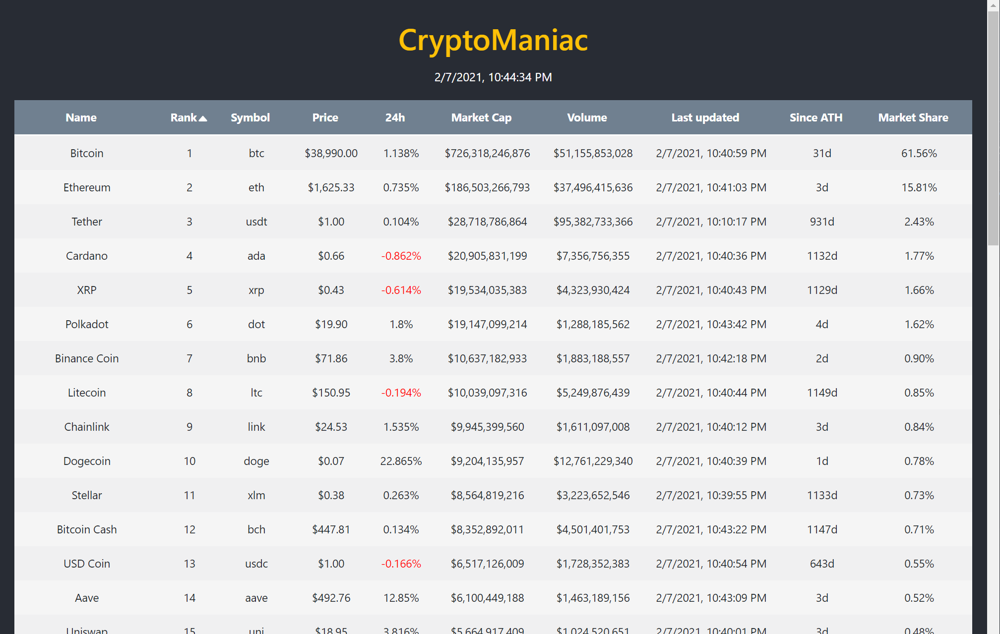
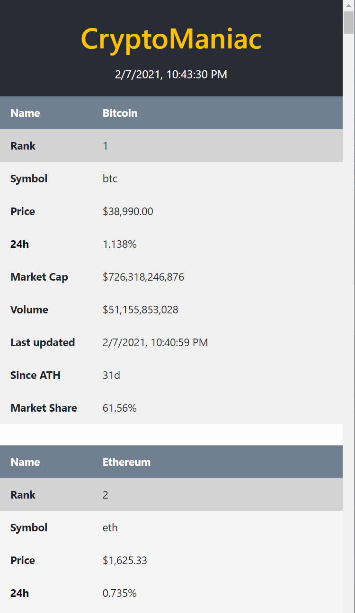

# About Crypto-Demo

Crypto-Demo displays a list of the top 100 cryptocurrencies.

- Polls real-time data from CoinGecko API every second 
- Allows sorting on every table column
  - Name
  - Rank
  - Symbol
  - Price
  - 24h change
  - Volume
  - Market Cap
  - Market Share
  - Since ATH
  - Last Updated
- Is responsive for mobile - displays each currency in a card format

## Built with
- React using [Create React App](https://github.com/facebook/create-react-app).
- React-table v7
- Axios
- Bootstrap for table with custom CSS overrides

## Screenshots
  <h3>Desktop</h3>
  

    
  

  <h3>Mobile</h3>
  

    
  

## To do

- Add prop-types for JavaScript version
- Convert to TypeScript
- Add tests

## To install and run 

In the project directory, you can run:

### `npm install`

### `npm start`

Runs the app in the development mode.\
Open [http://localhost:3000](http://localhost:3000) to view it in the browser.

The page will reload if you make edits.\
You will also see any lint errors in the console.

### `npm build`

Builds the app for production to the `build` folder.\
It correctly bundles React in production mode and optimizes the build for the best performance.

The build is minified and the filenames include the hashes.\

